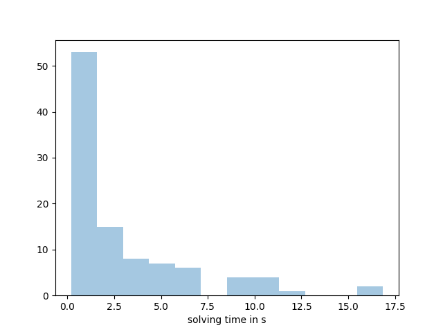

# Solving Rubik's Cube with a Neural Network

## Rubik's cube
The Rubik's Cube is a fascinating toy, not only for children but also for mathematicians and computer scientists.
The state space of the cube is represented as a graph with over 43 quintillion nodes!
Since the cube has six sides, each of which can be rotated in two directions, each node is connected to twelve other nodes.
The goal is to find a short path through the state space to the state where all faces of the cube have the same color.
It has been proven that any cube state can be solved in 26 moves or fewer.<br><br>

## Solving the Cube with a Neural Network
To solve the cube using neural networks, one can apply an A*-search algorithm with the neural network's output as a heuristic.
The A*-Algorithm is often used to find shortest ways, for example for pathfinding in computer games. In a searching loop, it prioritizes states, which seem to be promising, for example if they have a low euclidian distance to the target. This distance estimate is called the heuristic which the algorithm heavily relies on.<br>
For solving the Rubik's Cube, the heuristic is given by the neural network. It tries to guess the number of moves/edges which are necessary to reach the solved state s0. With a perfectly trained network it would be fairly easy to solve the cube using the A*-Algorithm. However, difficulties arise:
* The network can only be trained on a fraction of all possible cube states.
* Since the number of moves needed is unknown, no supervised learning is possible. The cube has to be trained by recursing on its own output (see below).
* The recursive training tends to be unstable.

## How the network is trained
As mentioned, the network tries to predict the number net(S) of moves needed to reach the solved state. This is done by the following training rule:
```
Algorithm 1
N = { net(S_neighbour) for S_neighbour being the states connected with S by one move }
n(S) <- min(N) + 1
n(S0) <- 0
```
Explanation: To the solved state S0, the value net(S0)=0 is assigned in a supervised fashion. Then, for example, if a state S has the scrambling depth 1, then the state S0 is in the set which is minimized. Since it is one edge apart from S, we add the number 1.<br>
<br>
A problem that arises with this training scheme is that the network's output tends to diverge towards infinity. This issue can be solved by adopting a teacher network with weights that stem from the actual network, but are delayed in time. The training scheme then looks like this:
```
Algorithm 2
N = { net_teacher(S_neighbour) for S_neighbour being the states connected with S by one move }
n(S) <- min(N) + 1
n(S0) <- 0
net_teacher.weights <- exp_avg(net.weights)
```
When solving the cube with an A*-algorithm, a second problem arises. The algorithm often gets stuck in states that appear to be close to the solved state but actually are not. This situation is analogous to navigating a maze: a pathfinding algorithm might identify locations that seem near the goal in terms of Euclidean distance, but they are far away when obstacles (walls) are considered.<br>
One trick that significantly accelerated the training process for me was solving the cube (in a straightforward manner) during the network's training. This approach helps identify states that appear close to the solution but are, in reality, far from it. The network learns to distinguish between truly near-solution states and these "pseudo-solution" states.
```
Algorithm 3
while training
    S <- random cube state
    while not stuck
        train network according to Algorithm 2 on S
        newS <- neighour state of S which minimized min(N) in Algorithm 2
        if (n(S) <= n(newS)): cube state S was stuck (break the loop)
        S <- newS
    end while
end while
```
The random cube states in Algorithm 3 are created by scrambling a random number of times (between 1 and 50).


## Statistics
The network was tested on cubes which were scrambled by 1000 moves.
* Solution rate: 100 %
* Median Time: 1.350 s
* Mean Time: 2.987 s
* Median number of moves: 30.00
* Mean number of moves: 29.90
* Mean number of nodes visited: 1451.0
* Median number of nodes visited: 3280.5


